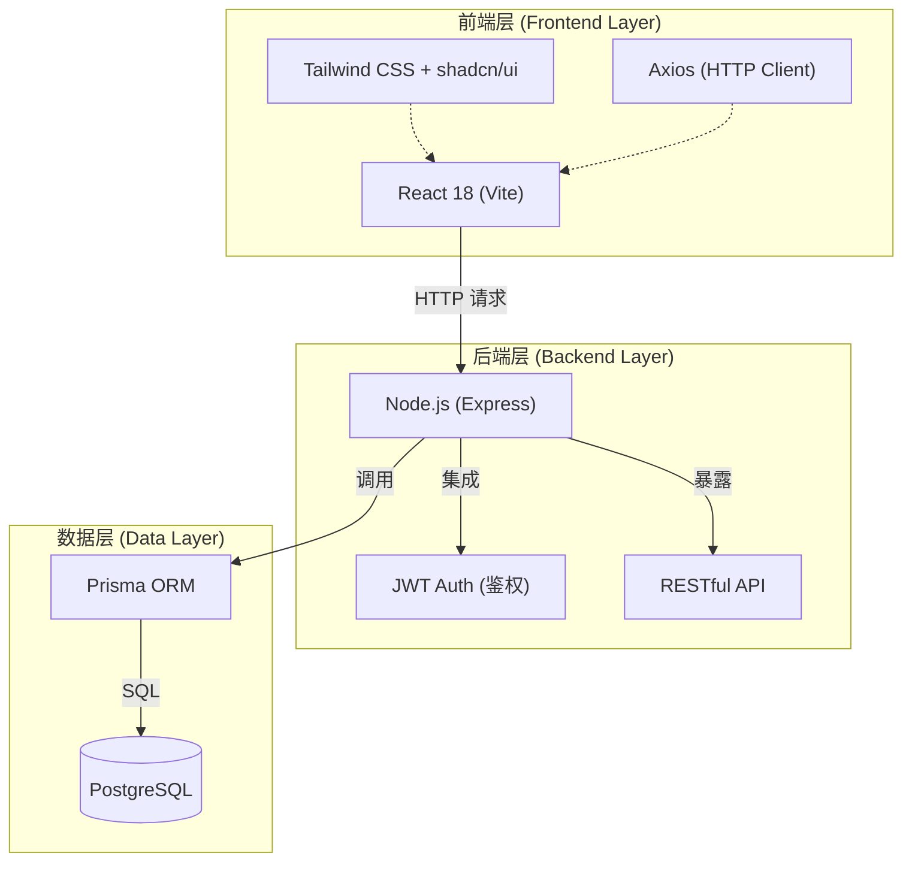
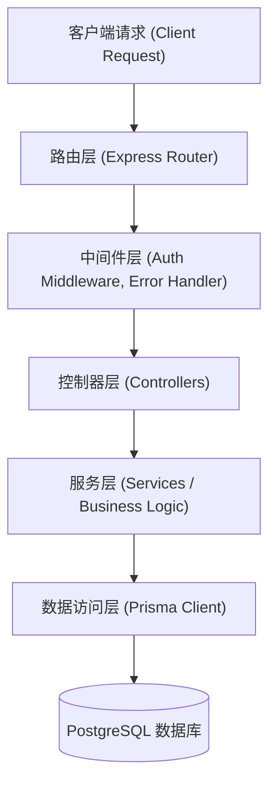
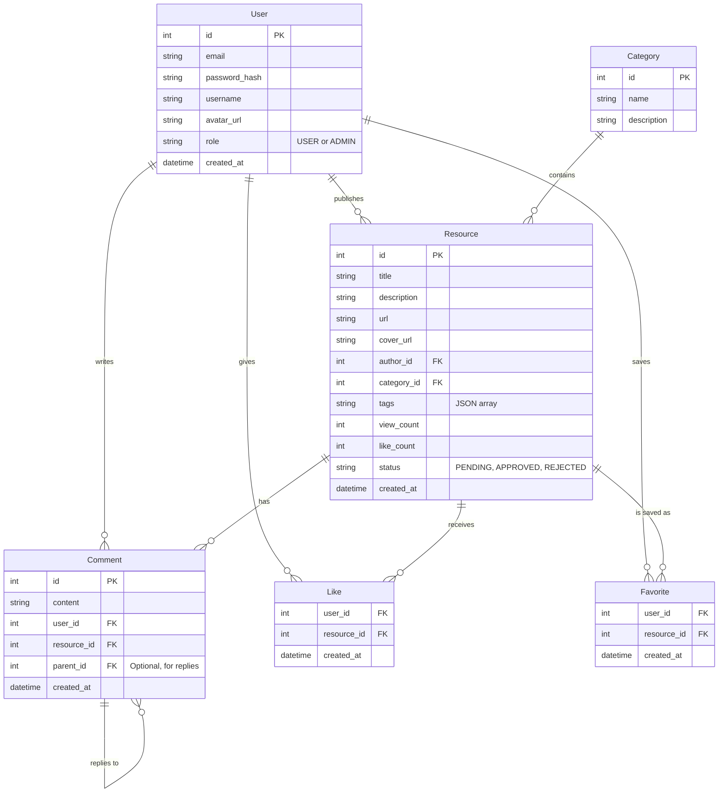

## 1. 架构设计



## 2. 技术栈说明
- **前端框架**: React 18 + Vite 构建工具
- **前端样式**: Tailwind CSS 3 (原子化 CSS) + shadcn/ui 组件库，支持深色模式。
- **状态管理**: Zustand 或 React Context (轻量级)
- **路由管理**: React Router v6
- **后端框架**: Node.js + Express
- **数据库 ORM**: Prisma (提供类型安全的数据库操作)
- **数据库**: PostgreSQL (关系型数据库，存储资源、用户、互动数据)
- **部署环境**: 支持 Docker 容器化，可部署于阿里云/腾讯云/AWS等通用云服务器。

## 3. 前端路由定义
| 路由路径 | 页面说明 | 权限要求 |
|-------|---------|---------|
| `/` | 首页：资源推荐、最新资源列表 | 无 |
| `/resources` | 资源列表页：按分类、关键词、热度检索 | 无 |
| `/resources/:id` | 资源详情页：资源详细信息、链接直达、评论区 | 无 |
| `/publish` | 资源发布页：发布表单 | 需登录 |
| `/profile` | 个人中心：我的发布、我的收藏、评论历史 | 需登录 |
| `/login` | 登录/注册页 | 未登录状态 |
| `/admin` | 后台管理页：资源审核、分类管理、用户管理、数据大盘 | 需管理员权限 |

## 4. 后端 API 定义
以下为部分核心 API 的定义：

- `POST /api/auth/register`：用户注册 (邮箱、密码)
- `POST /api/auth/login`：用户登录，返回 JWT Token
- `GET /api/resources`：获取资源列表 (支持分页、分类、搜索、排序)
- `GET /api/resources/:id`：获取资源详情
- `POST /api/resources`：发布资源 (需 Auth)
- `PUT /api/resources/:id`：更新资源信息 (需 Auth)
- `DELETE /api/resources/:id`：删除资源 (需 Auth 或 Admin)
- `POST /api/resources/:id/like`：点赞/取消点赞资源 (需 Auth)
- `POST /api/resources/:id/favorite`：收藏/取消收藏资源 (需 Auth)
- `GET /api/resources/:id/comments`：获取资源的评论列表
- `POST /api/resources/:id/comments`：发布评论 (需 Auth)
- `GET /api/user/profile`：获取当前用户信息及统计数据 (需 Auth)
- `GET /api/admin/dashboard`：获取后台统计数据 (需 Admin)

## 5. 后端架构图



## 6. 数据模型

### 6.1 数据模型定义 (ER图)



### 6.2 数据库 DDL (参考)

```sql
CREATE TABLE "User" (
    "id" SERIAL PRIMARY KEY,
    "email" VARCHAR(255) UNIQUE NOT NULL,
    "password_hash" VARCHAR(255) NOT NULL,
    "username" VARCHAR(100) NOT NULL,
    "avatar_url" TEXT,
    "role" VARCHAR(20) DEFAULT 'USER',
    "created_at" TIMESTAMP DEFAULT CURRENT_TIMESTAMP
);

CREATE TABLE "Category" (
    "id" SERIAL PRIMARY KEY,
    "name" VARCHAR(100) UNIQUE NOT NULL,
    "description" TEXT
);

CREATE TABLE "Resource" (
    "id" SERIAL PRIMARY KEY,
    "title" VARCHAR(255) NOT NULL,
    "description" TEXT NOT NULL,
    "url" TEXT NOT NULL,
    "cover_url" TEXT,
    "author_id" INTEGER NOT NULL REFERENCES "User"("id") ON DELETE CASCADE,
    "category_id" INTEGER NOT NULL REFERENCES "Category"("id") ON DELETE SET NULL,
    "tags" JSONB,
    "view_count" INTEGER DEFAULT 0,
    "like_count" INTEGER DEFAULT 0,
    "status" VARCHAR(20) DEFAULT 'PENDING',
    "created_at" TIMESTAMP DEFAULT CURRENT_TIMESTAMP
);

CREATE TABLE "Comment" (
    "id" SERIAL PRIMARY KEY,
    "content" TEXT NOT NULL,
    "user_id" INTEGER NOT NULL REFERENCES "User"("id") ON DELETE CASCADE,
    "resource_id" INTEGER NOT NULL REFERENCES "Resource"("id") ON DELETE CASCADE,
    "parent_id" INTEGER REFERENCES "Comment"("id") ON DELETE CASCADE,
    "created_at" TIMESTAMP DEFAULT CURRENT_TIMESTAMP
);

CREATE TABLE "Like" (
    "user_id" INTEGER NOT NULL REFERENCES "User"("id") ON DELETE CASCADE,
    "resource_id" INTEGER NOT NULL REFERENCES "Resource"("id") ON DELETE CASCADE,
    "created_at" TIMESTAMP DEFAULT CURRENT_TIMESTAMP,
    PRIMARY KEY ("user_id", "resource_id")
);

CREATE TABLE "Favorite" (
    "user_id" INTEGER NOT NULL REFERENCES "User"("id") ON DELETE CASCADE,
    "resource_id" INTEGER NOT NULL REFERENCES "Resource"("id") ON DELETE CASCADE,
    "created_at" TIMESTAMP DEFAULT CURRENT_TIMESTAMP,
    PRIMARY KEY ("user_id", "resource_id")
);

-- 索引
CREATE INDEX "idx_resource_category" ON "Resource"("category_id");
CREATE INDEX "idx_resource_status" ON "Resource"("status");
CREATE INDEX "idx_comment_resource" ON "Comment"("resource_id");
```
