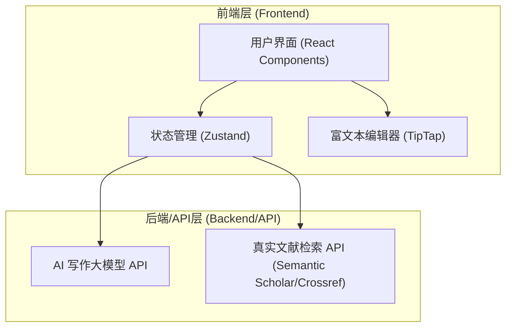
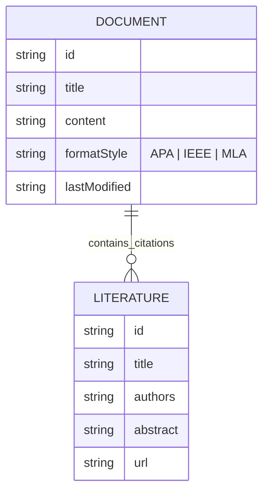

## 1. 架构设计


## 2. 技术说明
- **前端框架**: React@18 + tailwindcss@3 + vite
- **路由**: react-router-dom
- **状态管理**: Zustand
- **富文本编辑器**: TipTap (支持块级编辑和自定义扩展，如引用标记)
- **UI组件库**: Radix UI / shadcn/ui (提供无障碍、高质量的底层组件)
- **图标**: Lucide React
- **文献API (Mock/占位)**: 接入模拟的 Semantic Scholar API 数据，确保文献真实性结构。
- **初始化工具**: vite-init (npm create vite@latest)

## 3. 路由定义
| 路由 | 目的 |
|-------|---------|
| `/` | 落地页，介绍产品特色与真实文献AI写作优势 |
| `/dashboard` | 工作台主页，展示用户的论文项目列表 |
| `/editor/:id` | 核心智能写作与排版编辑器页面 |
| `/library` | 个人文献管理中心 |

## 4. API 定义 (前端对接大模型与文献库)
```typescript
// 1. 真实文献检索接口
interface SearchLiteratureRequest {
  query: string;
  limit?: number;
}

interface LiteratureResponse {
  id: string;
  title: string;
  authors: string[];
  year: number;
  abstract: string;
  url: string;
  citationCount: number;
}

// 2. AI 基于真实文献的生成接口
interface AIGenerateRequest {
  context: string; // 当前段落上下文
  prompt: string; // 用户指令，如"基于此文献扩写"
  referenceIds: string[]; // 选中的真实文献ID
}

interface AIGenerateResponse {
  content: string; // 生成的包含引用的文本
  citations: Array<{ text: string, refId: string }>; // 引用映射
}
```

## 5. 数据模型 (前端状态)
### 5.1 数据模型定义

