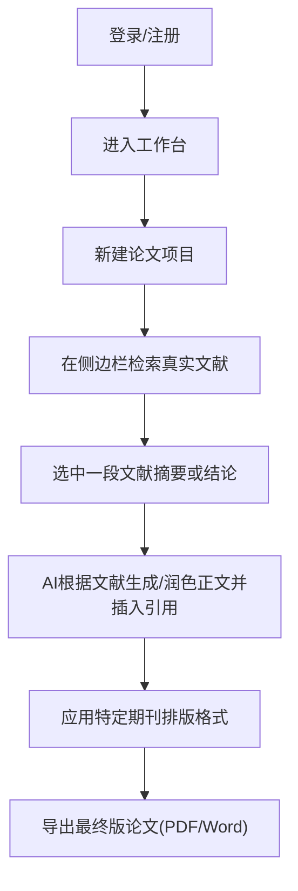

## 1. 产品概述
- **项目目标**：打造一个基于真实学术文献的AI辅助论文写作与智能排版平台，帮助科研人员和学生高效完成学术论文。
- **核心价值**：解决传统AI写作中“胡编乱造参考文献”的痛点，通过接入真实文献库（如Semantic Scholar、Crossref等）实现有据可查的写作，并支持一键切换符合各期刊标准的排版格式（APA、IEEE等）。

## 2. 核心功能

### 2.1 用户角色
| 角色 | 注册方式 | 核心权限 |
|------|----------|----------|
| 普通用户 | 邮箱/第三方授权 | 创建项目、文献检索、AI辅助写作、基础格式排版导出 |

### 2.2 功能模块
1. **工作台主页**：最近项目列表、新建论文、文献库入口。
2. **智能写作编辑器**：富文本编辑、侧边栏文献推荐、AI生成/润色（附带真实引用）。
3. **文献管理中心**：上传PDF、在线检索真实文献、自动提取元数据。
4. **一键排版与导出**：实时预览不同学术期刊排版格式，支持PDF、Word导出。

### 2.3 页面详情
| 页面名称 | 模块名称 | 功能描述 |
|----------|----------|----------|
| 工作台主页 | 项目管理 | 展示历史文档，支持新建空白文档或导入本地文档。 |
| 智能写作编辑器 | 写作核心区 | 提供类似Notion的块状编辑体验，支持多级标题、图表插入。 |
| 智能写作编辑器 | AI文献助手侧边栏 | 基于当前段落上下文，实时检索并推荐真实文献，一键插入引用（如[1]）。 |
| 智能写作编辑器 | 排版与导出菜单 | 侧边栏实时调整字体、行距、引用格式（APA/MLA等），一键生成带排版的预览。 |

## 3. 核心流程
用户核心操作流：新建论文 -> 搜索并添加真实文献 -> AI基于文献辅助生成段落 -> 一键应用期刊排版格式 -> 导出。

## 4. 用户界面设计
### 4.1 设计风格
- **主色调与辅助色**：采用极简学术风，主色调为知性蓝（#2563EB）与深岩灰（#1F2937），背景多用纯白（#FFFFFF）与柔和灰（#F3F4F6），降低视觉疲劳。
- **按钮风格**：扁平化设计，带有细微的悬浮阴影，边角微圆（Radius 6px）。
- **字体及大小**：正文使用优雅的衬线体或现代无衬线体（如 Inter, Merriweather），标题层次分明，排版预览区支持学术常用字体（Times New Roman等）。
- **布局风格**：类Notion的左右分栏结构（左侧导航/大纲，中间编辑器，右侧AI与文献助手）。
- **图标风格**：使用细线、克制的学术风图标（如Lucide Icons）。

### 4.2 页面设计概览
| 页面名称 | 模块名称 | UI元素设计 |
|----------|----------|------------|
| 智能写作编辑器 | 顶部工具栏 | 极简图标按钮，下拉选择排版格式，右侧导出按钮。 |
| 智能写作编辑器 | 中心编辑区 | 宽边距、大行高的沉浸式白纸隐喻设计，块级悬浮菜单。 |
| 智能写作编辑器 | 右侧AI文献侧栏 | 浅灰色背景，卡片式展示推荐文献，包含标题、作者、年份及“引用”按钮。 |

### 4.3 响应式设计
优先桌面端体验（Desktop-first），因论文写作多在PC端进行。移动端仅提供文档阅读和简单的文献检索/收藏功能。