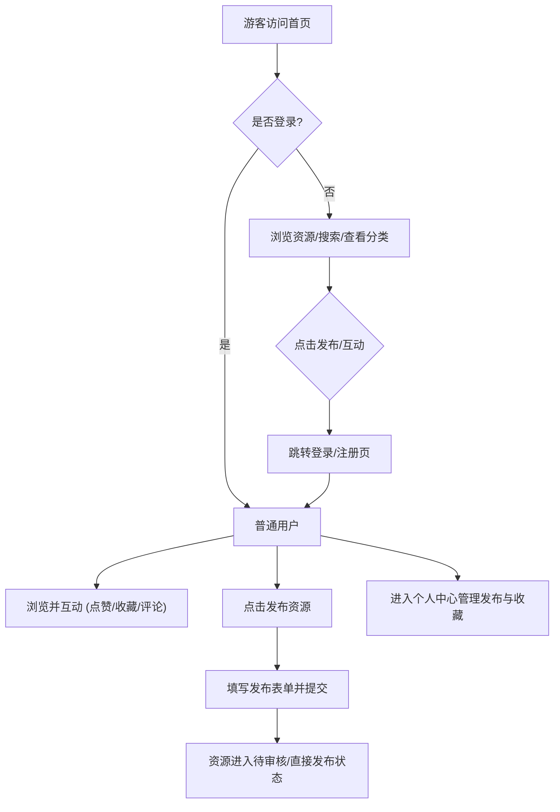

## 1. 产品概述
构建一个面向开发者和IT从业者的IT资源分享平台。
- 核心功能：分享云服务商活动/优惠信息、编程工具、教程、开源项目、技术文档、服务器/域名等IT资源。
- 目标群体：开发者、IT从业人员、学生群体。
- 产品价值：打造一个高质量的IT资源集散地，通过用户分享、分类聚合、搜索和互动，帮助用户快速获取和筛选优质的开发与学习资源。

## 2. 核心功能

### 2.1 用户角色
| 角色 | 注册方式 | 核心权限 |
|------|---------------------|------------------|
| 游客 | 无 | 浏览资源、搜索、查看分类 |
| 普通用户 | 邮箱/账号密码注册 | 发布资源、点赞、收藏、评论、管理个人主页 |
| 管理员 | 系统预设/后台添加 | 资源审核、分类管理、用户管理、数据统计 |

### 2.2 功能模块
1. **首页**：热门资源推荐、最新发布列表、快捷分类入口、搜索框。
2. **资源列表页**：支持按分类筛选（云服务、编程工具、技术教程、开源项目、域名服务器等），支持按关键词、热度、时间排序。
3. **资源详情页**：展示资源标题、分类、链接、简介、标签，支持点赞、收藏、评论互动及一键直达链接。
4. **资源发布页**：表单页面，供用户填写并发布IT资源。
5. **个人中心**：管理“我的发布”、“我的收藏”、“评论历史”，以及个人资料设置。
6. **后台管理**：资源审核与下架、分类配置、用户状态管理、基础数据统计。

### 2.3 页面详情
| 页面名称 | 模块名称 | 功能描述 |
|-----------|-------------|---------------------|
| 首页 | 头部导航 | Logo、搜索框、分类入口、发布按钮、登录注册/头像 |
| 首页 | 资源推荐区 | 轮播或置顶展示精选、热门的IT资源 |
| 首页 | 资源列表 | 按最新发布、热门点赞排序的资源卡片瀑布流或列表 |
| 资源列表页 | 筛选栏 | 分类切换、标签过滤、多维度排序（最新、最热） |
| 资源详情页 | 内容展示区 | 资源详细介绍、外链跳转按钮、发布者信息、发布时间 |
| 资源详情页 | 互动区 | 点赞、收藏、分享按钮，以及多级评论列表 |
| 资源发布页 | 发布表单 | 输入标题、选择分类、填写链接、编辑简介（支持Markdown）、添加标签 |
| 个人中心 | 用户信息板 | 展示头像、昵称、注册时间、获赞总数 |
| 个人中心 | 内容管理 | 列表展示自己发布的资源（可编辑/删除）和收藏的内容 |
| 后台管理页 | 数据仪表盘 | 展示今日新增用户、新增资源、活跃度等关键指标 |
| 后台管理页 | 资源管理表 | 列表展示所有资源，支持搜索、状态切换（通过/拒绝/下架） |

## 3. 核心流程
用户浏览与发布资源的典型流程。

## 4. 用户界面设计

### 4.1 设计风格
- **主色调**：科技极客风，以深邃蓝（#0F172A）或暗夜黑为主色调，辅以亮色品牌蓝（#3B82F6）或活力橙作为点缀和交互反馈色。
- **按钮与控件**：现代感圆角设计（8px或全圆角），提供清晰的悬浮（Hover）和点击反馈，轻量级阴影凸显层次。
- **字体排印**：使用无衬线字体（如 Inter, Roboto, 或系统默认中文字体），保证阅读体验；标题加粗对比明显，正文清晰易读。
- **布局风格**：采用卡片式布局（Card-based layout），内容区块边界清晰，页面留白充足（Generous negative space），避免信息拥挤。
- **图标风格**：使用简洁、线性的现代图标库（如 Lucide 或 Heroicons）。

### 4.2 页面设计概览
| 页面名称 | 模块名称 | UI 元素及风格 |
|-----------|-------------|-------------|
| 首页 | 导航栏 | 顶部固定，磨砂玻璃特效（毛玻璃），右侧为核心操作区 |
| 首页 | 资源卡片 | 包含资源Icon/配图、标题、摘要、分类标签、点赞评论数，悬浮时有微动效放大或阴影加深 |
| 资源详情页 | 头部信息区 | 大字号标题，清晰的直达链接按钮（强视觉引导），结构化的元数据展示 |
| 资源详情页 | 评论区 | 嵌套式的评论列表，清晰的层级缩进，简洁的输入框 |
| 发布资源页 | 表单区 | 居中卡片式表单，输入框聚焦时边框高亮，支持拖拽上传图片/图标 |
| 个人中心 | 侧边栏/标签页 | 左侧导航或顶部Tab切换，右侧/下方为对应的内容列表，风格统一 |

### 4.3 响应式适配
- **桌面端优先**：在大屏上采用多列网格布局（Grid），充分利用屏幕宽度展示资源卡片和侧边栏推荐。
- **移动端适配**：响应式折叠，导航栏收起为汉堡菜单，资源卡片变为单列流式布局，隐藏次要信息以保证核心内容的阅读体验，针对触摸屏优化按钮热区大小。
